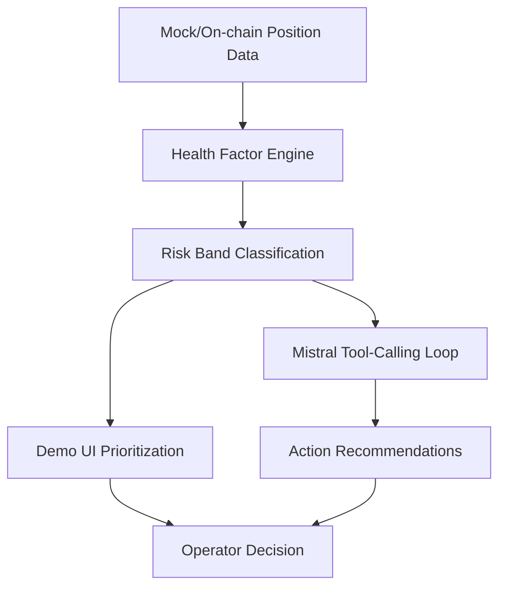

# RiskPilot-M

Baseline scaffold for the Mistral AI Worldwide Hackathon 2026.

## Objective
Build a risk-focused agent prototype using Mistral APIs with a runnable local loop before the hackathon start.

## Quickstart

### 1) Install dependencies
```bash
uv sync
```

### 2) Configure environment
```bash
cp .env.example .env
# then set MISTRAL_API_KEY
```

### 3) Run baseline Mistral loop
```bash
uv run python -m riskpilot_m.main --mode basic
```

### 4) Run tool-calling spike loop
```bash
uv run python -m riskpilot_m.main --mode tool-loop
```

### 5) Run D-7 health-factor demo (mock on-chain data)
```bash
uv run python -m riskpilot_m.main --mode health-demo
```

### 6) Run D-6 minimal demo UI (rich CLI)
```bash
uv run python -m riskpilot_m.main --mode demo-ui
```

## Architecture (draft)


## Current scope
- Minimal Mistral chat baseline
- Tool-calling spike with two local functions:
  - `score_risk`
  - `suggest_next_action`
- D-7 artifact: health-factor scoring engine over mock on-chain positions
- D-6 artifact: minimal rich CLI demo UI for risk score + next action
- D-4 artifact: submission draft in `docs/submission-draft.md`

## Project layout
- `riskpilot_m/main.py` — CLI entrypoint and Mistral loops
- `riskpilot_m/health_factor.py` — risk/health scoring logic
- `riskpilot_m/demo_cli.py` — minimal operator UI in terminal
- `data/mock_positions.json` — sample position data for demo
- `docs/strategy-prize-matrix-correction.md` — corrected target prioritization
- `docs/feb25-briefing-plan.md` — briefing checklist
- `docs/submission-draft.md` — draft final write-up

## Next milestone
- Connect on-chain adapters and automated alerts.
