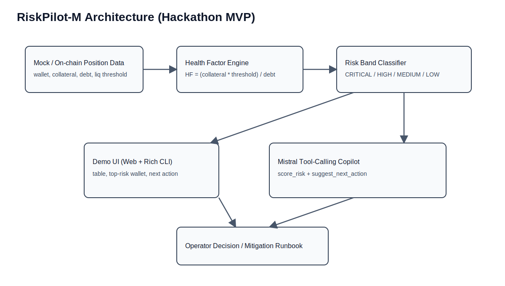
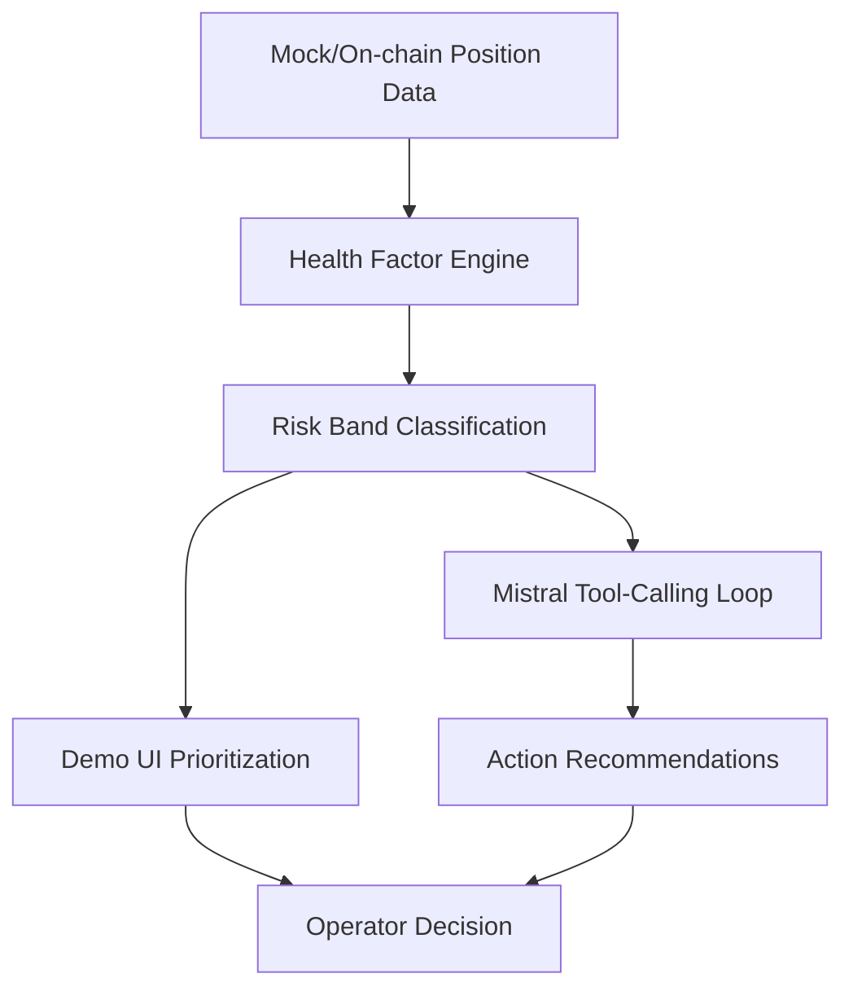

# RiskPilot-M

Baseline scaffold for the Mistral AI Worldwide Hackathon 2026.

## Live Demo (Web)
- Public URL: https://raw.githack.com/mgnlia/riskpilot-m/main/index.html
- Notes: static judge-friendly demo (no local setup required)

## Objective
Build a risk-focused agent prototype using Mistral APIs with a runnable local loop before the hackathon start.

## Quickstart

### 1) Install dependencies
```bash
uv sync
```

### 2) Configure environment
```bash
cp .env.example .env
# then set MISTRAL_API_KEY
```

### 3) Run baseline Mistral loop
```bash
uv run python -m riskpilot_m.main --mode basic
```

### 4) Run DeFi tool-calling loop
```bash
uv run python -m riskpilot_m.main --mode tool-loop
```

### 5) Run D-7 health-factor demo (mock on-chain data)
```bash
uv run python -m riskpilot_m.main --mode health-demo
```

### 6) Run D-6 minimal demo UI (rich CLI)
```bash
uv run python -m riskpilot_m.main --mode demo-ui
```

## Architecture Diagram




## Current scope
- Minimal Mistral chat baseline (default model: `mistral-large-latest`)
- DeFi-specific tool-calling loop with local functions:
  - `score_risk`
  - `suggest_next_action`
- D-7 artifact: health-factor scoring engine over mock on-chain positions
- D-6 artifact: minimal rich CLI demo UI for risk score + next action
- D-4 artifact: submission draft in `docs/submission-draft.md`
- D-3 prep: demo video plan in `docs/demo-video-plan.md`
- Sprint tracker: `docs/sprint-status.md`

## Project layout
- `riskpilot_m/main.py` — CLI entrypoint and Mistral loops
- `riskpilot_m/health_factor.py` — risk/health scoring logic
- `riskpilot_m/demo_cli.py` — minimal operator UI in terminal
- `data/mock_positions.json` — sample position data for demo
- `index.html` — judge-friendly web demo (static)
- `docs/architecture.svg` — architecture diagram asset
- `docs/submission-draft.md` — draft final write-up

## Audit Reconciliation (Cycle-5)
- Adversary response log: `docs/adversary-gate-cycle5-response.md`
- Human-critical open item: Luma registration proof artifact

## Submission Artifacts (Cycle-5)
- DeFi tool-loop fix commit: https://github.com/mgnlia/riskpilot-m/commit/940597d023bf95d3a46216e634b6d6badfdc8183
- Live demo URL: https://raw.githack.com/mgnlia/riskpilot-m/main/index.html
- Submission checklist: [docs/submission-checklist.md](docs/submission-checklist.md)

### Architecture PNG (judge-safe embed)

